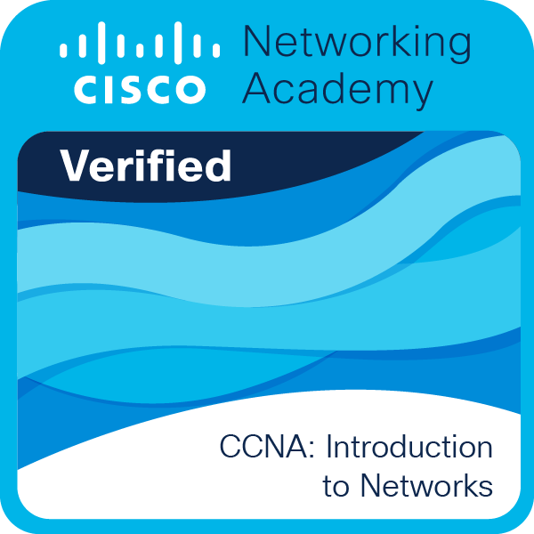

### Hi I´m Juan Esteban 👋
Welcome to my page, I´m software engineer from Granada, 🇪🇸 Spain

- I’m currently working on FIDESOL 🧑🏻‍💻

##### Some of the technologies I have worked with

### Licenses and certifications
<!--START_SECTION:badges-->

<!--END_SECTION:badges-->

# [📟 GitHub Stats](#-github-stats-)

# Top languages

# Follow me

<!--
- 🌱 I’m currently learning ...
- 👯 I’m looking to collaborate on ...
- 🤔 I’m looking for help with ...
- 💬 Ask me about ...
- 📫 How to reach me: ...
- 😄 Pronouns: ...
- ⚡ Fun fact: ...
-->
